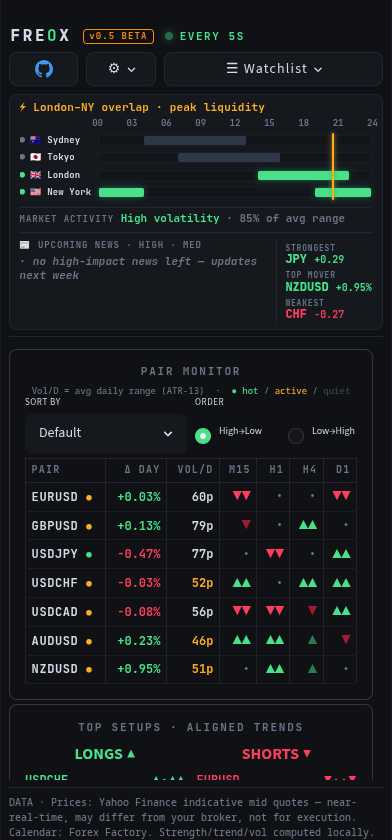

# Freox — Live Forex Cockpit


[](LICENSE)


> ## 🚧 BETA — Work In Progress
> **Freox is in active beta.** It's usable but unfinished — features change often,
> things may break, and data can be delayed or wrong. **Not financial advice and not
> for live trading decisions.** Try it, break it, and please open an issue with feedback.
> See the full disclaimer at the bottom.

An all-in-one live foreign-exchange cockpit — one dark, single-screen **forex dashboard**
that answers the three questions an FX trader actually asks: **is the market worth trading
right now, which pairs are moving, and how do they relate to each other.** No tabs, no
accounts, **no API keys** — just launch it and read the market. Built with Python +
Streamlit; covers all 28 major/minor FX pairs plus **gold (XAUUSD)** and **Bitcoin (BTC)**.



### What you can do with it

- **See if it's even worth trading** — a *Market Activity* gauge and per-pair live-activity
  dots read today's realized range against the average, because in FX **volatility, not
  direction, is what tells you to trade** (you can trade a trend either way — you can't
  trade a dead market).
- **Find where the action is** — a *volatility heatmap* (pair × timeframe) lights up the
  instruments running hot right now, so you skip the quiet ones.
- **Know when the action is** — a live *session clock* shows which trading sessions are
  open and highlights the **London–New York overlap**, the peak-liquidity window.
- **Avoid doubling your risk** — a *correlation matrix*, grouped by currency, shows which
  pairs are really the same bet (long EURUSD + short USDCHF ≈ one position, twice the size).
- **Gauge the whole board at a glance** — an 8-currency *strength meter*, a *pair monitor*
  with a Fibonacci 3-EMA trend stack across four timeframes, an aligned-trend *Top Setups*
  shortlist, and a live *economic calendar* with countdowns to high-impact news.
- **Leave it running** — a live 5-second refresh updates prices in place (no flicker), with
  a subtle number-roll animation on values that actually change. Every setting (watchlist,
  timeframes, strength window, refresh rate) persists in the URL, so a hard refresh restores
  your exact layout.

### Why Freox

- **Free & keyless** — public data only (Yahoo Finance + Forex Factory); nothing to sign up for.
- **Everything on one screen** — a trading-terminal layout, no tab-hopping.
- **Volatility-first** — built around *should I trade* and *where's the movement*, not just up/down arrows.
- **Accurate & honest** — true day-over-day change, Wilder ATR, symmetric currency strength; indicative-quote caveats stated up front.

> ### 🌀 Fibonacci-tuned by design
> Freox deliberately uses **Fibonacci numbers throughout its settings and calculations** —
> as it should. The trend stack is a **21 / 55 / 89** EMA ribbon, volatility runs on an
> **ATR-13**, the volatility-heat and correlation windows use **13** and **34** bars, and the
> activity thresholds sit on the Fibonacci retracement ratios (**0.382 / 0.618 / 0.786**).
> The lengths aren't arbitrary round numbers — they're the Fibonacci sequence the market
> already breathes in.

## Features

- **Currency strength meter** — relative strength of the 8 major currencies over a
  selectable window (24H / 1D / 1W), computed across the 28 major pairs.
- **Pair monitor** — live price, daily change, ATR volatility (in the instrument's native
  unit), a live-activity dot (today's range vs its average), and a **Fibonacci 3-EMA trend
  stack (21/55/89)** across M15 / H1 / H4 / D1. Sortable by any column.
- **Volatility heatmap** — pair × timeframe grid coloured by how hot each is running *right
  now* (recent range ÷ ATR, self-normalised so every cell is comparable).
- **Correlation matrix** — 34-day rolling correlation of returns, **grouped by currency** so
  the positive/negative blocks are obvious at a glance.
- **FX session clock** — which sessions (Sydney / Tokyo / London / New York) are live, the
  London–NY overlap, and a countdown to the next open/close. DST-accurate, weekend-aware.
- **Market Activity + Top Setups + KPI strip** — an is-it-worth-trading gauge, an
  aligned-trend shortlist, and strongest/weakest currency + next high-impact event.
- **Economic calendar** — this week's events with impact rating and a live countdown; each
  links out to a news search. Cached to disk so a rate-limited source never blanks the panel.
- **Extra instruments** — gold (XAUUSD) and Bitcoin (BTCUSD) alongside the FX majors.
- **Trading-terminal UI** — dense, dark, monospace, auto-refreshing in place without flicker.

## Data sources

- **Prices / OHLC:** Yahoo Finance (indicative mid quotes).
- **Economic calendar:** Forex Factory weekly feed.

No accounts or API keys are needed.

## Requirements

- Python 3.10+

## Run

```bash
bash freox.sh
```

On first run this creates a local virtualenv and installs dependencies, then starts
the dashboard on your local network — one server for both your computer and your
phone. Open <http://127.0.0.1:8502> on this machine, or scan the QR code it prints
to open the phone layout on your phone (same Wi-Fi).

To run it manually instead:

```bash
python3 -m venv .venv && source .venv/bin/activate
pip install -r requirements.txt
streamlit run app.py --server.port 8502
```

## Project layout

```
app.py          Streamlit cockpit (UI + layout)
data_feed.py    Price + economic-calendar fetching, disk cache
indicators.py   Trend (Fib 3-EMA), ATR volatility, heat, currency-strength math
sessions.py     FX market-session clock (pure time logic)
freox.sh        One-command launcher (PC + phone, prints a QR code)
desktop_app.sh  Optional phone-shaped desktop app window
requirements.txt
```

## Roadmap

- Alerts (heat / price cross / imminent high-impact event → browser notification)
- Per-pair drill-down (bigger sparkline, key levels, that currency's news)
- More instruments (silver, oil, indices)
- Pivot points / key daily levels in the monitor

## Disclaimer

Freox is for monitoring and research only. Prices are indicative mid quotes from a
free source, are not real-time broker quotes, and must not be used for trade
execution. Nothing here is financial advice.

---

<sub>**Keywords:** forex dashboard · currency strength meter · FX volatility heatmap · correlation
matrix · forex session clock · London New York overlap · multi-timeframe analysis · ATR volatility ·
Fibonacci EMA ribbon · economic calendar · Forex Factory · Yahoo Finance · Streamlit trading dashboard ·
Python forex tool · XAUUSD gold · Bitcoin BTC · real-time market data · fintech.</sub>
