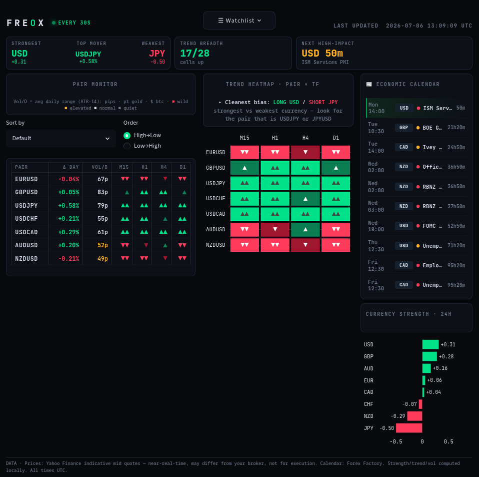

# Freox — Live Forex Cockpit


[](LICENSE)


> ## 🚧 BETA — Work In Progress
> **Freox is in active beta.** It's usable but unfinished — features change often,
> things may break, and data can be delayed or wrong. **Not financial advice and not
> for live trading decisions.** Try it, break it, and please open an issue with feedback.
> See the full disclaimer at the bottom.

An all-in-one live foreign-exchange cockpit — a single-screen **forex dashboard** with a
**currency strength meter**, multi-timeframe **trend heatmap**, per-pair **volatility (ATR)**,
and a live **economic calendar**. Built with Python + Streamlit, **no API keys required**.
Covers all major and minor FX pairs plus **gold (XAUUSD)** and **Bitcoin (BTC)**.



## Features

- **Currency strength meter** — relative strength of the 8 major currencies over a
  selectable window (24H / 1D / 1W), computed across the 28 major pairs.
- **Pair monitor** — daily change, volatility (ATR in the instrument's native unit),
  and trend arrows for M15 / H1 / H4 / D1. Sortable ascending/descending by any column.
- **Trend heatmap** — pair × timeframe grid to spot when a trend is aligned across
  all timeframes.
- **Economic calendar** — this week's events with impact rating and a live countdown;
  each event links out to a news search. Cached to disk so a rate-limited source
  never blanks the panel.
- **Extra instruments** — gold (XAUUSD) and Bitcoin (BTCUSD) alongside the FX majors.
- **Trading-terminal UI** — dense, dark, monospace, auto-refreshing in place.

## Data sources

- **Prices / OHLC:** Yahoo Finance (indicative mid quotes).
- **Economic calendar:** Forex Factory weekly feed.

No accounts or API keys are needed.

## Requirements

- Python 3.10+

## Run

```bash
bash launch.sh
```

On first run this creates a local virtualenv and installs dependencies, then starts
the dashboard. Open <http://127.0.0.1:8502> when it says it's ready.

To run it manually instead:

```bash
python3 -m venv .venv && source .venv/bin/activate
pip install -r requirements.txt
streamlit run app.py --server.port 8502
```

## Project layout

```
app.py          Streamlit cockpit (UI + layout)
data_feed.py    Price + economic-calendar fetching, disk cache
indicators.py   Trend, ATR volatility, currency-strength math
launch.sh       One-command launcher
requirements.txt
```

## Roadmap

- Price sparklines in the monitor
- Alerts (trend flip / imminent high-impact event)
- Per-pair candlestick detail view
- Configurable watchlists / layouts

## Disclaimer

Freox is for monitoring and research only. Prices are indicative mid quotes from a
free source, are not real-time broker quotes, and must not be used for trade
execution. Nothing here is financial advice.

---

<sub>**Keywords:** forex dashboard · currency strength meter · FX trend heatmap · multi-timeframe
analysis · ATR volatility · economic calendar · Forex Factory · Yahoo Finance · Streamlit trading
dashboard · Python forex tool · XAUUSD gold · Bitcoin BTC · real-time market data · fintech.</sub>
